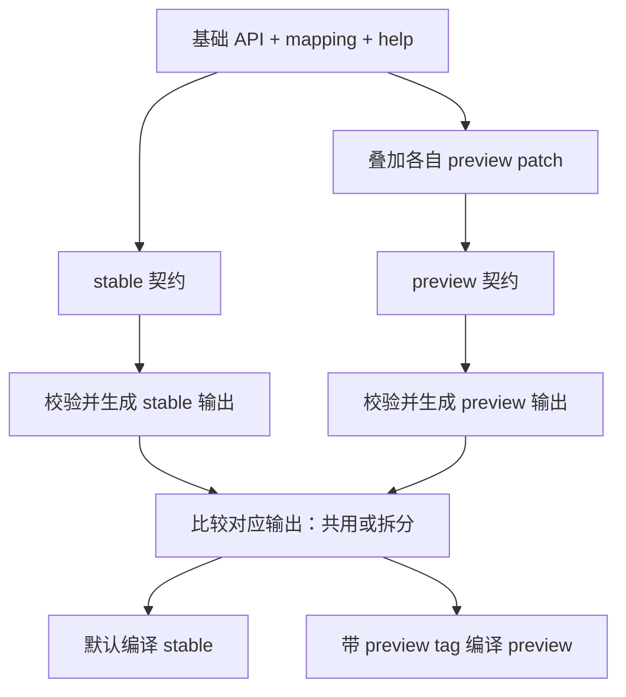

# AGR CLI 单分支 stable / preview 隔离方案

> **先读第 1 节确认边界，再读第 3 节的两个例子。** 核心阅读约 5 分钟，全文约 15 分钟。SDK 处理建议见第 4.5 节。
>
> 状态：已完成本地实现和验证，验证记录见第 5.5 节；正式发布仍需验证线上分发。更新日期：2026-09-16。
>
> 发布渠道与契约隔离在同一个 AGR CLI PR 中交付。上线前仍需完成 Webhook 分发服务部署及端到端验证。

## 1. 确定隔离边界

**采用单一 main：维护 stable 基础定义和 preview 差异，生成器按渠道生成，Go 编译时选择对应实现。**

### 1.1 已确定的约束

1. 不引入长期 stable / preview 双分支。
2. 隔离覆盖 API、mapping、help、schema，以及生成命令、手写命令和混合命令。
3. 支持新增完整模块和修改已有模块；preview 不删除 stable 已有命令。撤回 preview 独有模块仍然允许。
4. stable 保留现有文件名。无渠道差异的代码继续共用，仅有差异时增加 preview 文件。
5. 渠道在构建时确定，不增加允许正式二进制开启预览能力的运行时开关。

### 1.2 两个渠道的对外行为

| 入口 | stable | preview |
|---|---|---|
| 发布 tag | `vX.Y.Z` | `vX.Y.Z-preview.N`，N 从 1 开始 |
| API 契约 | 官方 `api.json` | 官方 API 叠加 `api.patch.json` |
| mapping / help | stable 基础定义 | 基础定义叠加对应 preview 差异 |
| 普通命令、补全、schema | 仅当前 stable 契约 | 当前 preview 契约 |
| 普通命令的请求 | 按 stable 契约校验 | 按 preview 契约校验 |

preview 可以调整已有命令的字段和实现，但必须保留 stable 已有命令及其可执行路径。命令集合包含 stable，字段类型和行为不要求是严格超集；未受 patch 影响的能力应保持一致。

**已确认：官方字段进入基础 `api.json` 后，即允许 stable 使用，不另设字段成熟度开关。** 正常 mapping 状态、显式参数排除和命令设计规则仍适用；官方 API 的进入不意味着自动新增所有手写工作流。

### 1.3 实施边界：原始 API 透传

**本轮按方案建议保留 `agr api call` 的原始透传语义。** 当前该入口支持调用未映射 Action，绕过资源命令映射；保留它有助于维持兼容性。

这意味着 stable 的隔离承诺是：不注册、展示或通过普通资源命令接受 preview 专属能力。用户主动通过 `agr api call` 发送原始请求时，仍由服务端决定是否接受。

如果要求 stable 连原始调用也禁止 preview 能力，需要额外收紧 Action / 字段准入。这属于另一个兼容性决策，不能靠 build tags 自动完成。

本方案也不承诺剔除第三方 SDK 包中所有预览符号，或屏蔽服务端额外返回的字段；它控制 CLI 提供的功能与普通请求契约。共享源码中的任意改动不会自动被识别为预览功能，开发者必须明确划定差异。

## 2. 构造完整的渠道契约

### 2.1 基础文件保留，差异单独维护

已实现的输入布局：

```text
api/ags/v20250920/
  api.json                  官方 API 基础，不写入预览补丁
  api.patch.json            已有：preview API 差异
  mapping.yaml              stable 映射基础
  mapping.patch.json        preview 映射差异
  help.json                 stable 帮助基础
  help.patch.json           preview 帮助差异
```

现有 `api.patch.json` 当前为空数组。新增 mapping / help patch 初始也为 `[]`；生成器发现缺少已约定的 patch 文件应报错，避免遗漏文件时悄悄构建 stable 行为。

**mapping / help patch 可以独立存在。** 例如官方 API 不变，但预览版调整 flag 名称、命令组织或示例，此时 API patch 可以为空。不能仅根据 API 的字段差集推断全部渠道差异。

### 2.2 按固定顺序合成和校验



建议 mapping / help 也使用 RFC 6902 操作数组，避免另外引入含糊的深度合并规则：

1. 将基础 mapping YAML 解码为只含字符串键的 JSON 数据树；help 原本就是 JSON。
2. 按文件内顺序应用 patch；映射键定位 Action、命令与字段，数组整体替换时明确给出目标数组。
3. `replace` / `remove` 前使用 `test` 校验原值；`add` 不允许覆盖已有键。失效补丁、冲突和不支持的操作必须报错。
4. 分别解析两个渠道的最终数据，执行对应的 API 引用、mapping 和 help 校验。
5. 仅生成全部校验通过的结果；不回写或重排基础 YAML / JSON。

底层 JSON Patch 应用能力可以复用，API 专属的路径和对象引用检查不能直接套到 mapping / help。实现时分别保留各自的语义校验。

### 2.3 每个渠道都验证四层一致性

| 层次 | 校验要求 |
|---|---|
| API | Action 的请求/响应、嵌套对象引用完整；patch 操作有明确结果 |
| mapping | 当前渠道所有 Action 有映射状态；不存在未知 Action / 字段、冲突 flag 或失效排除项 |
| help | 结构化命令、字段和输入说明指向当前渠道的有效目标；示例参数与真实命令匹配 |
| schema | 生成部分来自该渠道契约；手写部分与实际 descriptor 对齐，不残留另一渠道内容 |

`mapped`、`raw_only`、`deferred_with_reason` 表示映射状态，不表示发布成熟度。`excluded` 表示不生成某个 flag，也不能用来代替 preview 隔离，因为它不一定禁止 `--request` 使用该字段。

schema 不再另建一套需要人工同步的完整 JSON 定义。生成 schema 继续从 catalog / descriptor 派生；现有手写 schema 的差异拆到对应渠道实现。手写工作流有意只暴露 API 的一部分时，保留带理由的显式排除，不能以“它是手写命令”为由跳过覆盖检查。

校验的目标是先证明“当前渠道 API 字段 = 命令实际支持字段 + 有理由的例外”，再证明 descriptor、help 和最终 `agr schema` 对齐。不能仅比较两份可能同时漏字段的输出。

普通请求的契约来源必须明确，不能把所有命令都套进官方 `api.json`：

| 来源 | 当前例子 | 处理方式 |
|---|---|---|
| 官方 API 及其 preview patch | instance / tool 的 API 命令 | 使用对应渠道的 API 契约 |
| 已有手写工作流自己的契约 | `identity.create` 调用 `CreateWorkloadIdentity`，当前不在官方 API 快照中 | 在现有手写元数据入口明确关联命令、Action、请求和响应定义，保留已提供的 stable 行为；新增差异按渠道隔离 |
| 用户主动原始透传 | `agr api call` | 按第 1.3 节边界处理 |

手写契约声明必须覆盖实际调用的 Action 和字段，保持与 descriptor / schema 的一致性；已有 SDK 直调、数据面调用也需按各自接口定义验证。不把“官方 API 中不存在”直接等同于“不允许调用”，也不为所有未知 Action 增加静默放行分支。服务契约的来源独立于发布渠道，不能为了通过校验将手写工作流接口塞入官方基础快照。

### 2.4 契约读取入口统一选择渠道

在 `internal/apimeta` 提供显式接收 `stable` / `preview` 的完整契约加载入口，一次返回同一目录、同一渠道的 API、mapping、help 及渠道标识，并完成组合校验。渠道参数无隐式回退，非法值报错；默认值由各调用入口按下表决定。需要完整契约的消费者不得自行组合 `LoadEffectiveSpec` 与基础 `LoadMapping` / `LoadHelp`。

已完成迁移的消费者清单如下：

| 消费者 | 渠道规则与迁移范围 |
|---|---|
| `cmd/internal/cobragen` 的生成与 `check` | 显式加载两次完整契约，分别生成 stable / preview；生成器自身的 Go build tag 不决定目标渠道 |
| `cmd/internal/apigen` 的 `coverage` / `list-actions` / `schema` | 增加顶层 `--channel stable\|preview`，默认 stable；移除 `loadInputs` 中混合读取 API 与 mapping 的逻辑；文本/JSON 报告标明渠道，schema 原始 JSON 的渠道写到 stderr，保持 stdout 可解析 |
| `cmd/internal/apipatch` | `check` / `check-all` 保留 API patch 操作检查，同时通过共享入口检查两个渠道的完整契约；`render` 明确固定输出 preview 的 API 投影，不宣称输出完整契约 |
| `internal/apimeta` 与 `cmd/agr/contract_flags_test.go` 等契约测试 | 元数据组合测试显式覆盖两个渠道；比较真实命令树的测试按被测构建渠道加载契约，默认构建用 stable，`-tags preview` 用 preview；移除手工拼接 API 与 mapping 的旧测试入口 |
| `cmd/internal/docgen` 和运行时 help / schema | 继续消费按构建渠道生成的 catalog / descriptor，不单独重读基础文件；CI 分别用 stable / preview 构建生成到独立临时目录并验收 |

底层单文件解析与 patch 算法测试仍可直接读取对应文件。`apipatch rebase` / `delta` / `coverage` 继续只处理 API patch，`--require-empty` 仍仅判断 API patch 是否为空；这些结果不能代替完整渠道契约校验或证明没有其他 preview 差异。需要有效 API 投影的入口复用同一套渠道合成逻辑，不另写一套 patch 应用规则。

迁移验收须搜索并逐一归类所有 `LoadEffectiveSpec`、`LoadMapping`、`LoadHelp` 及直接读取契约文件的调用点，区分完整契约消费与单文件处理。使用同一个“新增 preview Action＋对应 mapping / help patch”样例验证：stable 维护报告不包含该 Action，preview 报告映射正确，两种构建的契约测试均通过；故意缺少 preview 映射时完整检查必须失败。仅 mapping / help 变化也要在维护输出或最终 help / schema 中得到对应结果。

## 3. 分别处理两类 patch 和三类命令

以下命令名和字段名仅用于说明机制，不代表本次要新增这些产品功能。

### 3.1 新增完整模块：preview 独有

假设新增预览命令组 `agr workspace`，同时涉及新的 API 和手写流程。

1. 新 Action / 对象写入 API patch，映射写入 mapping patch，帮助写入 help patch。
2. 生成器仅在 preview 中生成该模块的 API descriptor 和注册项。
3. 该模块独有的手写命令、辅助实现和测试均使用 `//go:build preview`。
4. stable 注册表不得导入该模块；帮助目录、补全、schema 列表均不展示该模块。
5. 用两个真实二进制验收：stable 返回未知命令，preview 正常解析并构造请求。

独立 preview 模块不需要在 stable 中生成空模块或无用占位实现。若公共代码确实依赖统一接口，则只为该接口提供明确的 stable 实现。

```text
internal/commands/workspace/create/
  api_preview.generated.go   preview 专属生成部分
  command_preview.go         preview 专属手写部分
  command_preview_test.go    preview 专属测试
```

若模块的 API 尚未被 AGS SDK 支持，采用第 4.5 节的动态 JSON 通道；不要求先给 SDK 增加生成类型。手写流程仍需明确响应结构与副作用，两种构建都必须独立编译通过。

### 3.2 修改已有模块：共用主体，拆出差异

假设已有创建命令新增 `ExperimentalMode`，并在 preview 中改变一段处理流程。

| 内容 | stable | preview |
|---|---|---|
| 已有创建命令 | 保留 | 保留 |
| `--experimental-mode` | 不注册 | 注册 |
| help / schema 中该字段 | 不展示 | 展示当前类型、说明与示例 |
| `--request` 携带该字段 | 发送前拒绝 | 按 preview 契约接受 |
| 流程实现 | 原稳定行为 | 选择对应预览实现 |

现有共享代码保持原样，仅在真实分歧处拆出函数或文件。不能复制整个模块，也不能给公共文件整体加 `!preview` 导致 preview 丢失主体。

若 patch 把字段从字符串改成对象，两个渠道分别生成各自类型和解析规则。字段级删除仍需同步调整 mapping、help 与 schema；不能通过删除或改名使 stable 已有命令在 preview 中失效。API / mapping patch 即使语法有效，只要最终移除了 stable 已有命令路径，就应在生成校验阶段报错。

### 3.3 命令实现方式决定需要检查哪些入口

| 命令类型 | 渠道处理方式 | 必须验证的边界 |
|---|---|---|
| 生成命令 | 从渠道 API / mapping / help 生成 | descriptor、注册、请求构造和最终 schema |
| 手写命令 | 公共主体共用；专属部分用互斥文件 | 注册、参数、帮助、schema、请求与依赖 |
| 混合命令 | 生成部分和手写部分采用同一渠道 | wrapper 的额外参数、复制/覆盖规则、SDK 与最终请求 |

新增字段涉及创建、更新、fork / clone 等路径时，要验证每条实际构造请求的路径。只给生成的 create 增加参数，不能视为整个功能已隔离完成。

### 3.4 注册生成器必须识别渠道

当前生成器包含静态手写模块列表，并通过读取 `command.go` 是否有 `Module()` 来选择手写或生成实现。引入 `command_preview.go` 后，沿用该逻辑会选错入口。

建议在现有注册生成流程上做两项定向扩展：

1. 静态手写模块表允许明确声明 preview 专属项；现有项默认共用。全新命令仍必须显式登记，不扫描任意目录后自动暴露为命令。
2. 按目标渠道的 Go 构建约束识别有效源码，用语法结构定位 `Module()` / `GeneratedModule()`；不再仅按固定文件名或字符串匹配判断。

对两个渠道分别验证导入包可编译、注册入口存在且唯一、命令 ID / 路径不冲突，并要求 stable 已有命令及其可执行路径在 preview 中仍然有效。本步不增加 stable 专属命令注册能力。平台专属实现继续遵循原有平台约束，不能通过全局 preview 筛选覆盖这些约束。

## 4. 保留 stable 文件名，控制生成与编译差异

### 4.1 三条输出规则

| 两个渠道的结果 | 文件形式 | 构建约束 |
|---|---|---|
| 内容相同 | 保留一个原文件 | 无渠道 build tag |
| 内容不同 | 原文件 + 新增 preview 文件 | 原文件 `!preview`；新增文件 `preview` |
| preview 新增模块 | 仅新增 preview 文件 | `preview` |

比较的是规范化后的生成内容，先比较再添加渠道 build tag。日期等不稳定内容不能参与生成结果。原有平台约束需要与渠道约束组合。

生成的已有命令若只剩 stable 版本，应先判定为违反命令保留约束，而不是生成一个 stable 专属命令。普通内部辅助文件仍可按差异需要使用互斥构建约束。

例如同一个已有命令出现差异时：

```text
api.generated.go            //go:build !preview
api_preview.generated.go    //go:build preview
```

手写模块采用相同原则：

```text
command.go                  共用主体，无渠道 build tag
behavior.go                 //go:build !preview
behavior_preview.go         //go:build preview
```

**stable 不增加 `_stable` 后缀。** `_preview.go` 文件名本身不负责条件编译，必须写 build tag。新增文件中也要正确包含构建约束与 package 之间的空行。

### 4.2 生成器管理全部派生文件

生成范围包括 API catalog、嵌入式 help、API descriptor 和命令注册表。手写 schema 通过渠道函数组织，不交由生成器删除。

1. 一次运行计算两个渠道的完整预期输出；开发者不用先切 stable 再切 preview。
2. 无差异时复用原文件；有差异时生成互斥文件，保留相同的导出函数或变量契约。
3. `check` 同时检测内容过期、文件缺失和已不再需要的旧生成文件，不修改源码。
4. 生成模式仅清理由生成器明确管理的过期路径，并校验生成标记；不得按目录递归删除手写代码或测试。
5. 重复生成结果一致。回到无差异状态时，移除过期 preview 文件及原文件的渠道限制。

catalog 和注册表目前是聚合文件，小范围功能差异也可能需要整份替代输出。这属于必要的生成差异；首期不为减少这部分体积重构整个存储模型。

### 4.3 构建和发布保持一致

双渠道生成和构建用法如下：

```bash
# 一次生成两个渠道的预期文件
rtk proxy go run ./cmd/internal/cobragen

# 检查两种渠道的生成结果
rtk proxy go run ./cmd/internal/cobragen check

# 默认 stable
rtk proxy go build -o /tmp/agr-stable ./cmd/agr

# 显式 preview
rtk proxy go build -tags preview -o /tmp/agr-preview ./cmd/agr
```

发行 workflow 根据第一步解析出的 channel 选择构建约束，同时校验 tag 与实际构建渠道一致。仅修改版本号不能改变功能集合；正式 tag 搭配 preview 构建必须失败。

在源码安装场景中，Go 也不会根据版本 tag 自动启用 `preview`：未来文档中的 preview `go install` 命令必须显式携带 `-tags preview`。稳定源码构建的默认行为保留。

### 4.4 普通请求的校验位置

渠道文件决定“注册和展示什么”，请求校验决定“实际允许发送什么”。普通资源命令的 flag、`--request`、混合命令拼接出的最终请求，均需走对应渠道的契约检查。

检查应在发送前覆盖 Action、字段、嵌套对象和数组元素；保留契约允许的自由键 map、已有合法编码和有理由的工作流例外。契约来源按第 2.3 节区分；SDK 是否认识某字段不能替代渠道准入判断。

本步不新增服务端业务语义推断，例如自行增加未在契约中声明的取值限制。响应 schema 随渠道变化，但不额外丢弃服务端原始响应字段。`agr api call` 按第 1.3 节的推荐边界保留原始透传。

### 4.5 SDK 处理建议：跳过强类型模型，保留通用签名客户端

**建议对 SDK 无法完整表达的 Action 使用动态 JSON 请求/响应，继续复用腾讯云通用 SDK 的签名和 HTTP 能力。** 本地已实现并通过签名 HTTP 测试；尚未做线上验证。

现有 `ControlPlane.Call(Action, map)` 已提供动态入口，但已匹配的 Action 仍固定走 AGS SDK 的 `FromJsonString`。因此新 Action 可以走当前兜底，已有 Action 新增字段、嵌套字段或改变类型却仍可能被拒绝或丢失。动态路由必须在强类型转换前决定。

```text
普通资源命令
  → 根据渠道和契约来源校验最终请求
  → 选择该 Action 的传输适配
      → SDK 能完整表达：保留现有强类型路径
      → SDK 不能完整表达：JSON + 通用 SDK 签名客户端
  → 解析响应并执行该命令的后续流程
```

1. **按契约能力选择路由。** 为受影响 Action 明确声明并校验动态适配，覆盖请求、响应及嵌套对象；不把整个 preview 二进制的所有调用一并切换。路由不能通过“先调用 SDK，报错再重发”来探测。字段转入基础后，如果 SDK 仍不支持，stable 也继续使用该动态适配，不能仅因版本转正就切回强类型路径。
2. **保留传输基础能力。** 复用通用 SDK，不自行实现签名；凭证处理与当前正式客户端一致，包括临时凭证 Token、region 和 endpoint。请求取消、超时及错误分类必须可验证。当前 raw 实现只创建长期凭证，并未把传入的 context 接到发送请求上，不能未经修正直接作为普通命令的新通道。
3. **避免不确定结果下重发写请求。** 当前 raw 路径在任意 `SendOctetStream` 错误后调用另一种发送方式。新适配应预先确定发送方式；网络超时、取消或业务错误不能触发这种重发。保留调用者的 ClientToken 等幂等字段，补测一次逻辑写操作实际只发送一次。
4. **响应和业务流程一起适配。** 动态响应保留完整字段，稳定提取资源 ID、状态和错误信息。现有混合命令对 SDK 响应类型有断言；需为受影响 Action 调整响应读取，不可直接返回 map 后跳过等待、文本/JSON 输出、Effects 或创建后的 Token 缓存。响应结构不合法时不能报告成功。
5. **从实际传输边界验收。** 使用本地 HTTP 服务驱动通用客户端，验证新增顶层/嵌套字段和类型变化最终到达请求体、扩展响应不丢失、临时凭证与取消生效。补测 `--wait`、Token 缓存和错误分类；不能只 mock `ControlPlane.Call`，否则会绕过需要证明的序列化与发送层。

该动态通道仍是经过契约校验的普通命令实现，不继承 `agr api call` 的用户级绕过语义。内部复用发送能力不意味着普通命令也跳过渠道校验。现有强类型调用中未受影响的部分本步保留。

#### 4.5.1 SDK 直调、等待与输出的接入方式

当前 `GetTool`、`GetInstance`、`GetDeployment` 绕过 `ControlPlane.Call`，直接调用 SDK 并返回 `*ags.SandboxTool`、`*ags.SandboxInstance`、`*ags.Deployment`。`resourcewait`、get、fork 及 `instanceview.CanonicalData` 又依赖这些类型。因此，只给 `Call` 增加动态分支无法保证扩展字段到达最终输出。

1. **共用 Action 的传输选择。** 在控制面内部让 `Call` 与受影响的直调方法共用“契约校验 → 选择 typed / dynamic → 发送”的入口，路由发生在 SDK 请求和响应转换前。按实际调用的 Action 排查所有直调方法，包括受影响的删除和 Token 方法；不能只检查三个 getter。内部发送入口不执行业务副作用，等待、Effects 和 Token 缓存仍由原有业务层负责，避免重复执行。
2. **为受影响资源提供不依赖 SDK 的结果视图。** 以完整 JSON 数据为底稿，仅为业务实际需要的 ID、状态、错误原因等提供校验后的读取方法；typed 结果可以转换进入该视图，dynamic 结果不能再转成 SDK 对象后返回。对应 getter 接口及其调用方在同一变更中迁移，未受影响的资源维持现有类型。
3. **贯通等待和输出。** `resourcewait` 使用新视图读取状态，保留原有按操作划分的成功、失败、not-found、超时和取消规则；有资源结果时返回完整数据，删除后的 not-found 沿用现有结果约定。get / list / 创建后的 `--wait` 共用相同输出转换；`CanonicalData` 一类转换保留已有字段规范化，同时携带扩展字段，不能继续用 SDK 字段白名单重建结果。RequestId 等元数据仍按现有结果封装规则处理。
4. **保留复制与覆盖语义。** fork / clone 从新视图读取源资源，按当前渠道的请求契约和显式字段策略构造新请求，不直接透传整个响应对象。新增配置字段必须明确继承、替换、仅覆盖或带理由排除，避免绕过 SDK 后仍在手写复制层丢字段。
5. **用真实入口验证响应链路。** 本地 HTTP 样例返回 SDK 不认识的顶层及嵌套字段，通过实际命令分别验证 list、get、get `--wait` 和创建后 `--wait` 的最终 JSON；等待期间返回确定的状态序列，校验最终状态和扩展字段同时保留。再验证 fork 的源字段进入最终请求、失败/取消行为与副作用次数；同一 Action 从 `Call` 和直调方法进入时必须选择相同传输策略。字段转入基础而 SDK 尚未升级的样例必须在 stable 下重复验证。

## 5. 按五个检查点实施和验收

### 5.1 实施顺序

| 顺序 | 实施内容 | 完成证据 |
|---|---|---|
| 1 | 渠道契约加载：API / mapping / help 基础与 patch，明确手写契约来源；按第 2.4 节迁移全部消费者 | 新模块、字段修改与冲突有确定结果；删除已有命令被拒绝；维护工具与契约测试不混用渠道 |
| 2 | 双渠道生成与旧文件管理 | 共用、互斥、单渠道文件均正确；重复生成无变化 |
| 3 | 生成 / 手写 / 混合命令接入及受影响 Action 的动态适配，覆盖 SDK 直调和资源结果视图 | 两种构建的注册、help、schema、发送内容和后续流程一致；get / wait / fork 不因 SDK 类型丢字段 |
| 4 | 发布 workflow、CI、patch E2E 工具和开发文档接入 | tag 与编译渠道一致；默认 stable；CI 检查两种构建和文档输出；E2E 实际测试 preview |
| 5 | 模块转正和撤回演练，完整 review | 差异可合回、可删除，无孤立注册或旧生成文件 |

这五项均属于第二步。安装器渠道选择、分渠道更新缓存和 `agr update --channel` 留到后续，不在本轮顺带实现。

### 5.2 CI 的验收矩阵

当前真实 API patch 为空，不能仅用现有仓库生成两次就声称隔离已验证。必须在隔离的临时源码副本中加入非空测试样例，通过真实生成器构建两个二进制。

| 测试组 | 必须覆盖 |
|---|---|
| 契约差异 | API 新模块；已有字段新增/改类型/删除；仅 mapping 或 help 改动；维护报告与契约测试使用同一渠道组合；错引用和冲突失败；官方字段进入基础后 stable 可用 |
| 命令差异 | 生成、手写、混合命令；注册、完整 help、补全、请求/响应 schema；preview 保留 stable 已有命令 |
| 请求边界 | 多种输入和嵌套结构；实际 SDK / 动态发送与响应；直调、get / list / wait 输出和 fork 请求保留扩展字段；临时凭证、取消、写请求不重发、等待与缓存；拒绝请求时发送次数为零 |
| 生成生命周期 | 空 patch、重复生成、转正、撤回、旧 preview 文件清理、手写文件保留 |
| 发布与平台 | stable / preview 两种测试配置；现有五个平台构建；tag 与构建渠道不匹配时失败 |

以真实契约为权威源做双向集合检查。向测试契约新增一个字段后，若手写命令、descriptor 或 schema 没有支持或明确排除，CI 必须失败；不能用手写的“预期字段列表”掩盖同步遗漏。

新增隔离用例应先证明在当前单渠道实现上失败，再证明新实现通过。本地请求验证不代表真实服务端已接受；非空真实 API patch 仍需遵守仓库已有的 live E2E 与 review 要求，但其构建工具必须同步适配渠道。

当前 patch E2E 会从提交归档分别重建 worker 和候选 CLI，并清空 `GOFLAGS`。本步须在这两个构建命令中显式选择 preview，不能依赖外层环境或 launcher 的构建 tag。报告需绑定源提交、实际构建渠道及候选制品身份，并从真实重建入口验证 preview 行为。stable 的负向隔离使用同一提交的 stable 构建验证。

现有 patch 覆盖工具只识别 API patch。mapping / help 独立变化和手写 preview 功能另由对应的渠道功能测试覆盖，API patch 为空时的 `not_applicable` 不能当作这些功能已通过验证；纯文案变化不因此被要求执行带凭据的 live E2E。

### 5.3 转正与撤回

**转正**：官方 API 更新确认吸收某项能力后，在同一变更中移除对应 API patch，将已确认成熟的 mapping / help 差异合入基础文件，并将手写实现转为共用；重新生成后检查是否还需要 preview 替代文件。

**官方字段进入基础即允许 stable 使用。** 对应的默认参数和请求能力可以随基础更新进入 stable，不增加独立的字段成熟度开关。应在同一变更中处理已过时的 API patch 和冲突的 mapping / help patch；独立的命令交互或手写新功能仍按其基础/preview 定义管理，不能宣称它们能继续屏蔽已经进入基础的字段。

字段是否允许 stable 使用与 SDK 是否能传输该字段是两个判断：SDK 落后时保留动态适配，待兼容性验证通过后再移除。不得为了转正而把内部预览字段直接写入官方 `api.json` 基础快照。

**撤回**：删除对应 preview 差异和专属实现，重新生成并验证 stable 行为保持不变。可以撤回 preview 独有模块，但不支持仅在 preview 中删除 stable 已有命令。不能直接清空所有 patch，否则会撤回不相关的预览功能。

### 5.4 合并与发布条件

1. 第二步全部检查通过后，与第一步 `c55a958` 的完整变更一起 review，并按既定安排进入一个 AGR CLI PR。
2. 两个渠道的用户可见净变化分别检查，更新中英文开发/发布说明，删除“预览发布暂时禁用”等过时描述。
3. 预览 tag 发布前，核实 webhook 已部署，COS 读取权限和全局单并发前提成立；本地测试不能替代这些检查。
4. GitHub Release / CDN / Homebrew 的实际结果按发布流程验证，不能把合并 PR 或创建 tag 当成发布完成。

### 5.5 当前完成状态

| 项目 | 状态 |
|---|---|
| 第一步发布渠道隔离 | AGR CLI 已本地提交；webhook 已独立提交推送 |
| 第二步方案 | 按复审实施；原始 API 透传沿用第 1.3 节兼容性建议 |
| 第二步代码与测试 | 已本地实现；双渠道回归、非空补丁二进制测试、10 个发行目标编译、双渠道文档生成通过 |
| 第二步线上验证 | 未执行 |

本地验收入口：

- `go test ./cmd/... ./internal/... ./tests/integ ./tests/channels`；preview 使用 `GOFLAGS=-tags=preview`。
- `go test ./tests/credential -run '^TestMock_'` 验证既有工作流的本地签名 HTTP 链路。
- `cobragen check`、`apipatch check-all`、两种构建的文档生成、lint 和发布路由测试。
- 非空补丁测试位于 `tests/channels/channels_test.go`：临时复制源码，覆盖生成/手写/混合命令、命令集合保留、help/schema/补全、拒绝请求零发送、原始字段/大整数保真、get/wait/list/fork、转正及过期文件清理。

实现注记：动态路由递归比较当前 API 契约与 SDK 请求/响应类型；请求和响应保留原始 JSON，复用通用签名客户端。既有 identity/credential 工作流使用独立的 `WorkflowSpec` 请求声明，响应维持开放 JSON 对象，未将其伪装为官方封闭响应契约；新增工作流字段仍须同步其 descriptor/schema。

生产三份 patch 当前均为 `[]`。上述结果证明本地隔离和调用链路，不代表真实预览业务或线上发布已验证。后续将第一、二步合并成一个 AGR CLI PR；提交/推送及 webhook 部署、真实发布验证分别执行。
